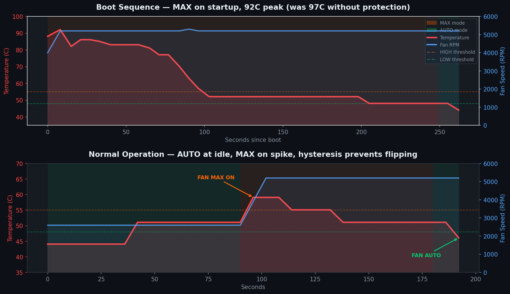

# Alehundred Fan

Lightweight fan control for HP Victus laptops. No bloat, no telemetry, no 1.5GB RAM wasted. Just a system tray icon that keeps your laptop cool.

## The problem

HP Victus laptops have terrible fan control out of the box. The fans barely spin while the CPU hits 90+ degrees on boot. There's no built-in automatic solution. You either leave it to the BIOS which reacts too slow, or you manually babysit it every time.

The real kicker: during Windows boot, the CPU spikes to 90-97C because nothing tells the fans to spin up. HP apparently designed these things to cook themselves.

## The solution

A dead simple 0/1 approach. No fancy fan curves, no overthinking it.

- Above your HIGH threshold: fans go to max (5200+ RPM)
- Below your LOW threshold: fans go back to auto (BIOS handles it, ~2600 RPM)
- Between LOW and HIGH: no change (hysteresis, so it doesn't flip back and forth)

That's it. The BIOS already has a decent fan curve for normal temps. All we need is a safety net that slams the fans to max when things get hot. Why complicate what works with a binary decision.

## How it works

Uses WMI BIOS calls through the `hpqBIntM` interface exposed by the `ACPI\PNP0C14` driver. Lightweight, direct, no background services.

The script sends command 0x20008 with CommandType 0x27 (MaxFanSpeed) to toggle fans. It re-sends the max command every cycle while in MAX mode, because Omen services like to override fan settings periodically. This way even if something resets it, 5 seconds later the fans are back at max.

On startup, fans go straight to MAX as boot protection. Windows loading drivers, indexing, updates, antivirus all happening at once pushes the CPU hard. The fans only drop to auto once temps stabilize below your LOW threshold.

## Compatibility

Any HP laptop that exposes the `hpqBIntM` WMI class should work. Quick test — open PowerShell as admin and run:

```
Get-CimInstance -Namespace root/WMI -ClassName hpqBIntM
```

If it returns an instance, you're good.

### Confirmed working

- HP Victus 15-fb0xxx (AMD Ryzen 5 5600H, BIOS F.25, Windows 11) — built and tested on this one



### Should work but not tested

- HP Victus 15-fb series (AMD, 2022-2023)
- HP Victus 16-e0xxx (AMD, 2021)
- HP Victus 16-s1xxx (2024)
- HP Victus 15-fa series (Intel, 2022-2024)
- HP Omen 15-dh series (2019-2020)
- HP Omen 15-ek series (2020)
- HP Omen 15-en series (AMD, 2020)
- HP Omen 16-b series (Intel/nVidia, 2021-2022)
- HP Omen 16-k series (Intel, 2022-2023)
- HP Omen 16-n series (AMD, 2022-2023)
- HP Omen 17-ck series (2023-2024)
- HP Omen Transcend 16 (2023)

Basically any HP Victus or Omen with the `HPOmenCustomCapDriver` driver installed.

## Requirements

- Python 3.x
- `pystray` - system tray icon
- `Pillow` - icon drawing

Install dependencies:

```
pip install pystray Pillow
```

## Usage

Run it (no console window):

```
start pythonw alehundred_fan.py
```

First time you need to run from an admin terminal, or it will auto-elevate via UAC prompt.

### System tray

Right-click the fan icon in the tray:

- **Show status** - current temp, fan speeds, mode, transition count
- **Set thresholds** - change LOW/HIGH temps on the fly, saved to `alehundred_fan.json`
- **Install at startup** - registers a Task Scheduler task that runs at logon with admin privileges. One click, done forever
- **Remove from startup** - removes the task
- **Open log** - opens `alehundred_fan.log` in notepad
- **Quit** - sets fans back to auto and exits

### Tray icon colors

- Green: AUTO mode, all good
- Orange: MAX mode, fans at full speed
- Red: error (WMI call failed or can't read temperature)

### Config

Thresholds are saved in `alehundred_fan.json` next to the script. You can edit it by hand or use the Set thresholds menu. Default:

```json
{
  "temp_high": 55,
  "temp_low": 48,
  "check_interval": 5
}
```

## Boot behavior

The script starts with fans at MAX immediately. This is intentional. During Windows boot the CPU can spike to 90+ degrees in seconds while everything loads. Starting at MAX means the fans are already at 5200 RPM cooling things down by the time Windows finishes loading. Once temps drop below your LOW threshold, fans switch to auto.

Tested difference: without boot protection the CPU hit 97C on boot. With it, peaked at 88C.

## Temperature sensor

Reads from `MSAcpi_ThermalZoneTemperature` (ACPI thermal zone THRM_0). This is the motherboard thermal zone, not the CPU die sensor directly. It typically reads about 4 degrees higher than the actual CPU die temp. For a safety-focused tool this is fine since it's the more conservative reading.

## Log

Everything goes to `alehundred_fan.log` next to the script. Every reading, every transition, every error. Sample:

```
2026-03-13 15:48:35  INFO       Initial mode: MAX (boot protection)
2026-03-13 15:48:41  INFO     88.1 C | MAX | Fans: 4000/3800 RPM
2026-03-13 15:48:48  INFO     92.1 C | MAX | Fans: 5200/5200 RPM
2026-03-13 15:49:25  INFO     83.1 C | MAX | Fans: 5200/5200 RPM
2026-03-13 15:49:50  INFO     77.1 C | MAX | Fans: 5200/5200 RPM
```

## Why 0/1 and not a fan curve

Because the BIOS already handles normal temps fine at 2600 RPM. The only problem is it doesn't react fast enough to spikes. A fan curve would add complexity for zero real benefit. Under 55C the auto mode is silent and adequate. Over 55C you want max cooling immediately, not some intermediate speed that lets the temp keep climbing. Everyone overcomplicates this trying to be clever with curves and steps. Just 0 or 1. Done.

## License

Do whatever you want with it. If it helps keep your Victus alive longer, that's all that matters.

HP, Victus and Omen are trademarks of HP Inc. This project is not affiliated with or endorsed by HP.